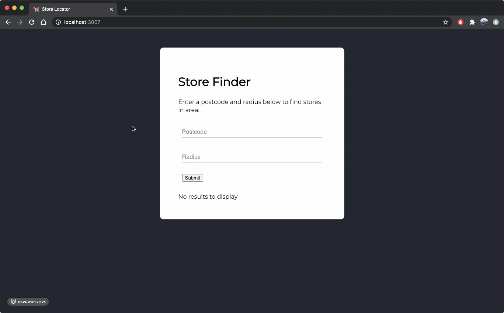

# :dog: Store Location App
Full stack application that, given a postcode and radius, returns a list of stores (ordered from north to south) and a distance.



## Requirements
- Python 3.8
- Docker
- Flask
- Flask-Restx

All requirements are installed from requirements.txt during docker container build.

## Build
### Docker Compose
Clone repo and then execute the following code in root directory of application
```
docker-compose up -d --build
```

## Test
Run the following commands and ensure tests past
```
docker-compose exec backend pytest
```
Navigate to the below in brower to ensure server is operational:
```
http://localhost:5001/ping
```

## Swagger
For an overview of endpoints go to:
```
http://localhost:5001/doc
```


## UI
To use the react.js userinterface, navigate to the below when containers are running.
```
http://localhost:3007
```
